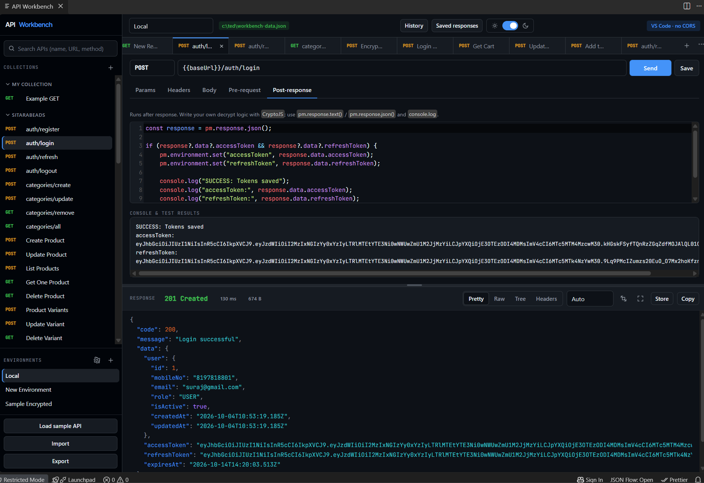

# API Workbench

A local API client and development workbench built directly into Visual Studio Code.

**Everything stays local: collections, environments, history, and saved responses never leave your machine.**

## How to Use

### Open the Workbench (WebView)

1. Open Command Palette (`Ctrl + Shift + P` / `Cmd + Shift + P`)
2. Search **API Workbench: Open**
3. The toolbox opens in a new tab

## Key Features

- 🚀 Send API requests (GET, POST, PUT, PATCH, DELETE) from VS Code
- 📁 Collections & folders to organize requests
- 🌎 Environments with variables (`{{baseUrl}}`, `{{accessToken}}`, etc.)
- 🔐 Pre-request scripts (JavaScript + CryptoJS / AES support)
- 🧪 Post-response scripts for validation & token handling
- 🔑 Token management (access / refresh tokens)
- 📜 Request history
- 💾 Saved responses
- 📤 Import / Export collections & environments - Postman Compatible
- 🏠 Fully local storage

## Privacy

Everything runs inside the VS Code WebView or the extension host.  
**No backend or external API is used.** Your data never leaves your machine.

## License

MIT

### Screenshot
